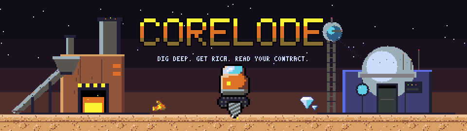
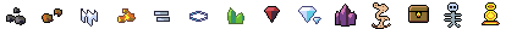
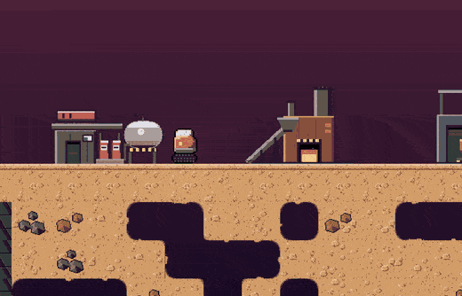

<div align="center">



**A clean-room, browser-only remake of the 2004 Flash mining classic** — identical mechanics
and numbers, all-new code, art, audio, and words. TypeScript + Phaser 3. No server, no
plugins, no install.


<br><br>

<a href="https://2tricky4u.github.io/CoreLode/">
  
</a>

<sub>runs in any modern browser · phone-friendly ("Add to Home Screen" ships a real manifest) · touch + gamepad supported</sub>

<br><br>



<br><br>



<sub>Real gameplay, captured live from this exact build. And yes, one of those dirt tiles is
secretly a gas pocket. That's the point: you can't tell.</sub>

</div>

## ⛏️ Quick start

**Just play:** [**2tricky4u.github.io/CoreLode**](https://2tricky4u.github.io/CoreLode/) — nothing to install.

**Hack on it:**

```bash
npm install
npm run dev        # → http://localhost:5173
npm test           # sim tests incl. the encoded canonical ruleset
npm run build      # atlas → typecheck → production bundle in dist/
npm run preview    # serve the production build
```

Deploy anywhere static (GitHub/GitLab Pages — set `BASE_PATH=/repo-name/` when building).

On a phone the game fills the whole screen (no letterbox) — bigger screens just see more of
the mine. Use the title-menu **Fullscreen** button, or install it from the browser menu for
a true full-screen app. Touch controls scale with the screen and have a size setting under
Settings → Controls.

## 🎮 Controls

| Input | Action |
| --- | --- |
| <kbd>↑</kbd><kbd>←</kbd><kbd>↓</kbd><kbd>→</kbd> / <kbd>W</kbd><kbd>A</kbd><kbd>S</kbd><kbd>D</kbd> | Move, fly (up), drill (down/left/right). You can never drill upward; sideways only from a standstill. |
| <kbd>E</kbd> | Interact with the building you're standing on (a "press [E]" prompt appears) |
| <kbd>F</kbd> | Fuel cell |
| <kbd>R</kbd> | Nano-welders |
| <kbd>X</kbd> | Dynamite |
| <kbd>C</kbd> | Plastic explosive |
| <kbd>Q</kbd> | Discount teleporter |
| <kbd>M</kbd> | Priority transporter |
| <kbd>Esc</kbd> / <kbd>P</kbd> | Pause (not in the deep) |

Touch controls and gamepads are fully supported, and a complete **Controls & Guide** screen
lives on the title and pause menus.

## 📐 Fidelity

The entire ruleset was recovered from the original game's bytecode and encoded as data +
CI-gated tests — see [`docs/calibration.md`](docs/calibration.md) for every constant and its
provenance: 42 Hz sim, 36×600 world, exact worldgen algorithm, physics integrator,
fall-damage rule, fuel-burn formulas, the full transmission schedule, boss tables, NG+
scaling, even the undocumented earthquake mechanic and boss loot. Values not recoverable are
marked `CAL()` and tuned against the Ruffle-hosted original
([`docs/fidelity-checklist.md`](docs/fidelity-checklist.md)).

Quality-of-life extras (autosave, minimap, colorblind glyphs, seeded runs, speedrun timer)
all default **OFF**; Purist Mode force-disables them.

## 🤝 Co-op — 2–6 players, serverless

The story world, shared: one wallet, per-pod everything else, respawn-for-a-fee deaths,
synchronized pause, and the boss fighting the whole crew. One player hosts over **WebRTC
with QR-code / invite-link signaling** (paste-code is the desktop fallback) — the site stays
100% static (GitHub Pages works as-is) and it runs on an offline LAN. Deterministic
host-sequenced lockstep keeps all sims bit-identical, with a hash sentinel and one-click
host resync if anything drifts.

Full walkthrough, protocol notes, and caveats: [`docs/coop.md`](docs/coop.md). Co-op is
remake-only — a golden solo replay test guarantees the 2004 rules are untouched.

## 🏗️ Architecture

```
src/core/     the whole game as pure TypeScript — zero Phaser/DOM, CI-enforced
src/game/     thin Phaser 3 presentation: tilemap, sprites, camera, audio synthesis
src/ui/       DOM overlay (HUD, shops, transmissions, screens); no framework
src/content/  every name and line of dialog — the clean-room content pack
src/platform/ IndexedDB saves, clipboard/share, QR generate + scan, signaling tokens
tools/art/    the procedural art pipeline (there are no hand-painted assets)
```

- **`src/core/`** — fixed 42 Hz tick, typed events out, commands in
  (`tools/check-layering.mjs` breaks the build on any impurity).
- **`src/game/audio/`** — ~45 ZzFX one-shot patches, a fully synthesized score (mode
  tables → voice patches → tracker patterns → a lookahead Web Audio transport) and a
  depth-reactive ambient bed. Six pieces: title, three mine beds that cross-fade as you
  descend, a two-layer boss theme (the second layer arrives with form 2), and an ending.
  `npm run music:preview` renders every piece and layer to `.wav` plus a level/clipping
  report — the audio analogue of the art contact sheet.
- **`tools/art/`** — char-grid sprites + parametric texture generators under a strict DB32
  ruleset ([`tools/art/STYLE.md`](tools/art/STYLE.md)), refined through a
  render→look→critique loop (previews: `docs/art-preview.png`, `docs/art-scene.png`).
  Runtime "juice" (palette-cycled lava, canvas-texture lighting, particles, glows) lives
  in `src/game/scenes/GameScene.ts`.

## 📜 License notes

Original code/art/text throughout; SFX are runtime-synthesized (ZzFX). Game mechanics and
numeric constants are not copyrightable; this project ships no asset, name, or text from the
2004 original. See [`assets/CREDITS.md`](assets/CREDITS.md).

---

<div align="center">
<sub>The banner, button, and gem strip are generated by the game's own art pipeline (<code>npm run readme:assets</code>);
the gameplay reel is a live capture of the game in a browser.</sub>
</div>
